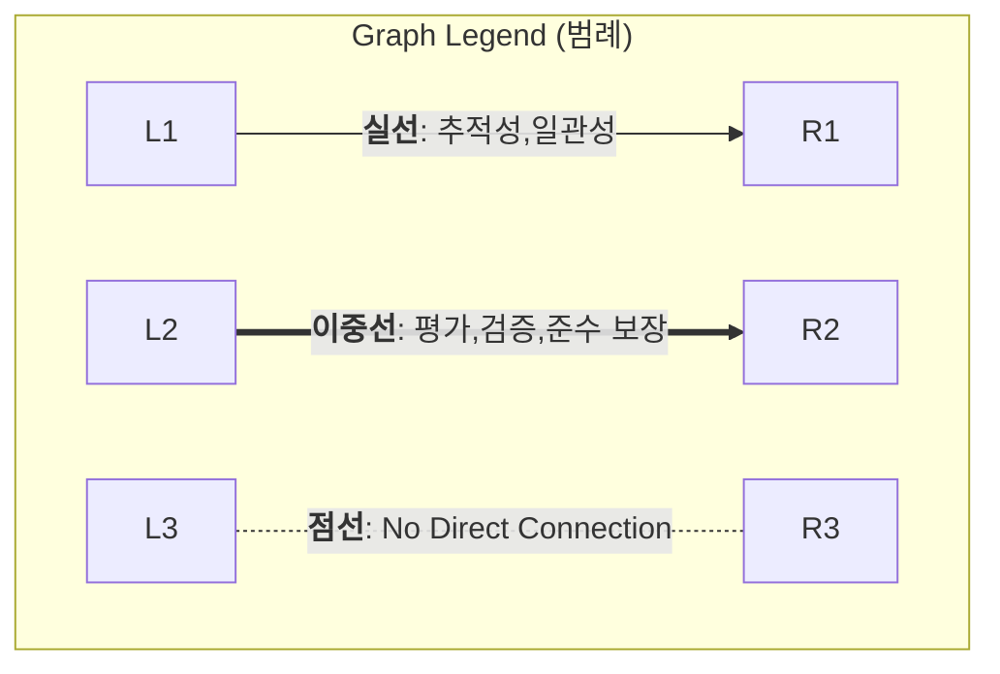
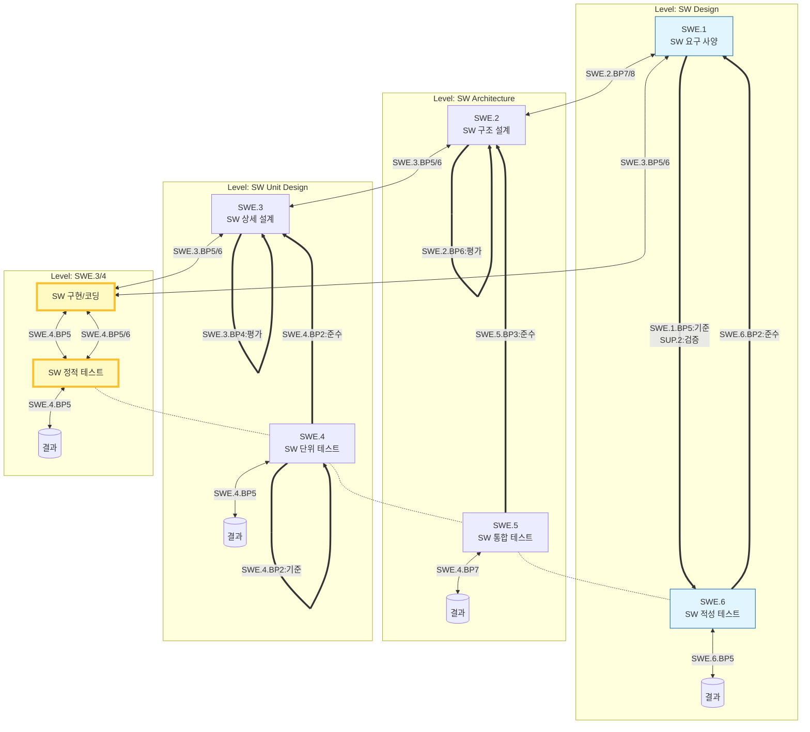
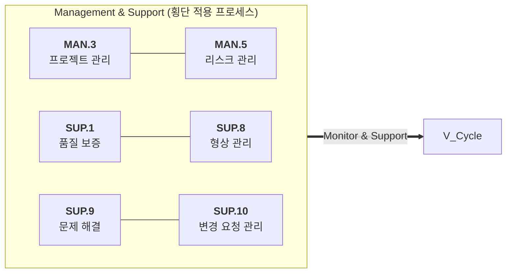

# ASPICE 3.1 기준 VDA 스코프 프로세스

> VDA(독일 자동차산업협회) 스코프 기준 Automotive SPICE 3.1에서 평가 대상이 되는 핵심 15개 프로세스

---

## 전체 구조 요약

```
Primary Life Cycle Processes
├── Engineering
│   ├── System Engineering (SYS)  — 4개
│   └── Software Engineering (SWE) — 6개
Organizational Life Cycle Processes
├── Management (MAN)              — 1개
└── Support (SUP)                 — 4개
                              합계: 15개
```

---

## 1. Primary Life Cycle Processes — Engineering

### 1.1 System Engineering (SYS)

| 프로세스 ID | 프로세스 명                             | 목적 (Purpose)                                               | 주요 입력                                    | 주요 출력 (Work Products)                           |
| ----------- | --------------------------------------- | ------------------------------------------------------------ | -------------------------------------------- | --------------------------------------------------- |
| **SYS.2**   | System Requirements Analysis            | 시스템 요구사항 도출·분석·검증 및 추적성 확보                | Customer requirements, System concept        | System Requirements Specification (SRS)             |
| **SYS.3**   | System Architectural Design             | 시스템 아키텍처를 정의하고 요구사항을 SW/HW/기타 요소에 할당 | SRS                                          | System Architecture Design, Interface Specification |
| **SYS.4**   | System Integration and Integration Test | 시스템 구성요소를 통합하고 통합 수준에서 검증                | System Architecture Design, Integration Plan | System Integration Test Spec/Report, Release Note   |
| **SYS.5**   | System Qualification Test               | 통합된 시스템이 SRS를 만족하는지 적격성 시험 수행            | SRS, System Integration complete             | System Qualification Test Spec/Report               |

---

### 1.2 Software Engineering (SWE)

| 프로세스 ID | 프로세스 명                                    | 목적 (Purpose)                                                | 주요 입력                              | 주요 출력 (Work Products)                       |
| ----------- | ---------------------------------------------- | ------------------------------------------------------------- | -------------------------------------- | ----------------------------------------------- |
| **SWE.1**   | Software Requirements Analysis                 | SW 요구사항 도출·분석·검증 및 시스템 요구사항과의 추적성 확보 | SRS, System Architecture               | Software Requirements Specification (SwRS)      |
| **SWE.2**   | Software Architectural Design                  | SW 아키텍처를 정의하고 요구사항을 SW 컴포넌트에 할당          | SwRS                                   | Software Architecture Design, SW Interface Spec |
| **SWE.3**   | Software Detailed Design and Unit Construction | SW 유닛 수준의 상세 설계 수행 및 소스코드 구현                | SW Architecture Design                 | SW Detailed Design, Source Code                 |
| **SWE.4**   | Software Unit Verification                     | SW 유닛이 상세 설계를 만족하는지 정적·동적 검증 수행          | Source Code, SW Detailed Design        | Unit Test Spec/Report, Static Analysis Report   |
| **SWE.5**   | Software Integration and Integration Test      | SW 유닛/컴포넌트를 통합하고 통합 수준에서 검증                | SW Architecture Design, Verified Units | SW Integration Test Spec/Report                 |
| **SWE.6**   | Software Qualification Test                    | 통합된 SW가 SwRS를 만족하는지 적격성 시험 수행                | SwRS, Integrated SW                    | SW Qualification Test Spec/Report               |

---

## 2. Organizational Life Cycle Processes

### 2.1 Management (MAN)

| 프로세스 ID | 프로세스 명        | 목적 (Purpose)                                        | 주요 입력                   | 주요 출력 (Work Products)     |
| ----------- | ------------------ | ----------------------------------------------------- | --------------------------- | ----------------------------- |
| **MAN.3**   | Project Management | 프로젝트 범위·일정·자원·비용을 계획하고 실행·모니터링 | Contract, Statement of Work | Project Plan, Progress Report |

---

### 2.2 Support (SUP)

| 프로세스 ID | 프로세스 명                   | 목적 (Purpose)                                                       | 주요 입력                           | 주요 출력 (Work Products)                          |
| ----------- | ----------------------------- | -------------------------------------------------------------------- | ----------------------------------- | -------------------------------------------------- |
| **SUP.1**   | Quality Assurance             | 제품 및 프로세스가 정의된 기준과 계획을 준수하는지 독립적으로 보증   | Project Plan, Process Definitions   | QA Plan, QA Audit Report, Non-Conformance Record   |
| **SUP.8**   | Configuration Management      | 작업 산출물의 식별·버전 관리·기준선(Baseline) 설정 및 변경 이력 관리 | Work Products                       | CM Plan, Baseline Records, CM Status Report        |
| **SUP.9**   | Problem Resolution Management | 발견된 문제를 기록·분류·분석·해결하고 상태를 추적                    | Defect/Issue input from any process | Problem Report, Resolution Record, Trend Analysis  |
| **SUP.10**  | Change Request Management     | 변경 요청을 기록·평가·승인·구현하고 영향을 추적                      | Change proposals, Problem Reports   | Change Request Log, Impact Analysis, Change Status |

---

## 3. 프로세스 간 추적성 연계 개요

### 3.1. V-Cycle 개발 프로세스 참조





### 3.2. 아래 프로세스는 모든 절차에 적용



---

## 4. Capability Level 평가 기준 (참고)

| Level    | 명칭        | 핵심 기준                                      |
| -------- | ----------- | ---------------------------------------------- |
| **CL 0** | Incomplete  | 프로세스 미수행 또는 목적 미달성               |
| **CL 1** | Performed   | 프로세스 목적 달성 (work product 존재)         |
| **CL 2** | Managed     | 계획·모니터링·산출물 관리 수행                 |
| **CL 3** | Established | 표준 프로세스 정의 및 적용, 프로세스 자산 관리 |
| **CL 4** | Predictable | 측정 기반의 정량적 관리                        |
| **CL 5** | Optimizing  | 지속적 개선 활동 수행                          |

> VDA 스코프 기준 OEM 공급망 진입 최소 요건: **CL 2** 이상 (SWE/SYS 핵심 프로세스 기준)
