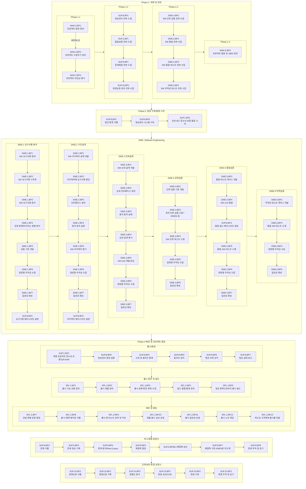

# ASPICE 전체 프로젝트 관리

# MAN.3 Process 프로젝트 관리

| PROCESS & BP | DESCRIPTION                                                                                                                                               | WP           |
| ------------ | --------------------------------------------------------------------------------------------------------------------------------------------------------- | ------------ |
| MAN.3.BP1    | 업무의 범위를 정의한다. 프로젝트의 목표, 동기, 경계를식별한다.                                                                                            | 성과 1       |
| -            | 비고1 - 이는 일반적으로 프로젝트 수명주기와 고객의 개발 프로세스가 서로 일관성이 있음을 의미한다.                                                         |              |
| MAN.3.BP2    | 프로젝트 수명주기를 정의한다.                                                                                                                             | 성과 2       |
| -            | 프로젝트의 범위, 상황, 규모, 복잡성에 적합한 프로젝트의 수명주기를 정의한다.                                                                              |              |
| MAN.3.BP3    | 프로젝트의 실현 가능성을 평가한다.                                                                                                                        | 성과 2       |
| -            | 시간, 프로젝트 추정치, 이용 가능한 자원과 관련된 제약 조건 내에서 기술적 실현 가능성에 관한 프로젝트 목표 달성의 실현 가능성을 평가한다.                  |              |
| MAN.3.BP4    | 프로젝트 활동을 정의하고, 감시하고, 조정한다.                                                                                                             | 성과 3, 5, 7 |
| -            | 정의된 프로젝트 수명주기와 추정치에 따라 프로젝트 활동과 활동 간의 의존성을 정의하고, 감시하고, 조정한다. 요구에 따라 활동과 활동 간의 의존성을 조정한다. |              |
| -            | 비고2 - 활동과 관련 업무 패키지의 구조와 관리 가능한 규모는 적절한 진척 상황 감시를 지원한다.                                                             |              |
| -            | 비고3 - 프로젝트 활동은 일반적으로 엔지니어링, 관리, 지원 프로세스를 다룬다.                                                                              |              |

**작업 산출물**

| 성과   | 산출물                         |
| ------ | ------------------------------ |
| 성과 1 | WP.08-12                       |
| 성과 2 | WP.13-19                       |
| 성과 3 | WP.08-12 / WP.14-06 / WP.14-09 |
| 성과 7 | WP.13-16 / WP.13-19 / WP.14-02 |

# SWE.1 SW 요구사항 분석

| PROCESS & BP | DESCRIPTION                                                                                                                    | WP           |
| ------------ | ------------------------------------------------------------------------------------------------------------------------------ | ------------ |
| SWE.1.BP1    | SW 요구사항을 명세한다.                                                                                                        | 성과 1, 5, 7 |
| -            | 시스템 요구사항, 시스템 아키텍처를 이용하여 SW의 필수 기능과 성능을 식별하고,                                                  |              |
| -            | SW 요구사항 명세서에 기능적, 비기능적 SW 요구사항을 명세한다.                                                                  |              |
| -            | 비고1 - 기능과 성능에 영향을 미치는 적용 파라미터는 시스템 요구사항의 일부분이다.                                              |              |
| -            | 비고2 - SW만 개발하는 경우, 이해관계자 요구사항이 SW에 요구되는 기능과 능력 식별을 위한 기초로 사용되어야 한다.                |              |
| SWE.1.BP2    | SW 요구사항을 구조화한다.                                                                                                      | 성과 2, 4    |
| -            | SW 요구사항 명세서에 SW 요구사항을 프로젝트 관련 군집으로                                                                      |              |
| -            | 그룹화, 논리적 순서로 정렬, 관련 기준으로 범주화, 이해관계자 요구에 따라 우선순위화하여 구조화한다.                            |              |
| -            | 비고3 - 우선순위화는 일반적으로 기능적 내용을 계획된 출시로 할당하는 것을 포함한다.                                            |              |
| SWE.1.BP3    | SW 요구사항을 분석한다.                                                                                                        | 성과 2, 7    |
| -            | 정확성, 기술적 실현 가능성, 검증 가능성을 보장하고 위험 식별을 지원하기 위해, SW 요구사항을 상호 의존성을 포함하여 분석한다.   | 성과 2, 7    |
| -            | 비용, 일정, 기술적 영향을 분석한다.                                                                                            | 성과 2, 7    |
| -            | 비고4 - 비용과 일정 관련 영향 분석은 프로젝트 추정치의 조정을 지원한다.                                                        |              |
| SWE.1.BP4    | 운영 환경에 미치는 영향을 분석한다. SW 요구사항이 시스템 앨리먼트의 인터페이스와 운영 환경에 미치는 영향을 분석한다.           | 성과 3, 7    |
| -            | 비고5 - 운영 환경은 SW가 실행되는 시스템(예, 하드웨어, 운영 체제 등)으로 정의된다.                                             |              |
| SWE.1.BP5    | 검증 기준을 개발한다. 요구사항 검증을 위한 정량적 및 정성적 방안을 정의한 검증 기준을 각 SW 요구사항에 대해 개발한다.          | 성과 2, 7    |
| -            | 비고6 - 검증 기준은 일반적으로 SW 요구사항 준수를 보장하기 위한 SW 시험 케이스나 다른 검증 방안 개발을 위한 입력으로 사용된다. |              |
| -            | 비고7 - 시험으로 다룰 수 없는 검증은 SUP.2 에서 다룬다.                                                                        |              |
| SWE.1.BP6    | 양방향 추적성을 수립한다. 시스템 요구사항과 SW 요구사항 간, 시스템 아키텍처와 SW 요구사항 간의 양방향 추적성을 수립한다.       | 성과 6       |
| -            | 비고8 - 양방향 추적성은 커버리지, 일관성, 영향 분석을 지원한다.                                                                |              |
| SWE.1.BP7    | 일관성을 보장한다. 시스템 요구사항과 SW 요구사항 간, 시스템 아키텍처와 SW 요구사항 간의 일관성을 보장한다.                     | 성과 6       |
| -            | 비고9 - 일관성은 양방향 추적성에 의해 지원되고, 검토 기록으로 증명될 수 있다.                                                  |              |

**작업 산출물**

| 성과   | 산출물                         |
| ------ | ------------------------------ |
| 성과 1 | WP.13-22 / WP.17-08 / WP.17-11 |
| 성과 2 | WP.15-01 / WP.17-50            |
| 성과 3 | WP.15-01 / WP.17-08            |
| 성과 4 | WP.15-01                       |
| 성과 5 | WP.13-21                       |
| 성과 6 | WP.13-19 / WP.13-22            |
| 성과 7 | WP.13-21 / WP.15-01            |

# SWE.2 SW 아키텍처 설계

| PROCESS & BP | DESCRIPTION                                                                                                                                            | WP                 |
| ------------ | ------------------------------------------------------------------------------------------------------------------------------------------------------ | ------------------ |
| SWE.2.BP1    | SW 아키텍처 설계를 개발한다.                                                                                                                           | 성과 1             |
| -            | 기능적, 비기능적 SW 요구사항에 대하여 SW의 앨리먼트를 명세하는 SW 아키텍처 설계를 개발하고 문서화한다.                                                 |                    |
| -            | 비고1 - SW는 SW 컴포넌트(SW 아키텍처 설계의 최하위 수준 앨리먼트)에 이르기까지 적절한 계층적 수준을 통해 앨리먼트로 분해된다.                          |                    |
| SWE.2.BP2    | SW 요구사항을 할당한다. SW 요구사항을 SW 아키텍처 설계에 할당한다.                                                                                     | 성과 2             |
| SWE.2.BP3    | SW 앨리먼트의 인터페이스를 정의한다. 각 SW 앨리먼트의 인터페이스를 식별하고, 개발하고, 문서화한다.                                                     | 성과 3             |
| SWE.2.BP4    | 동적 행태를 서술한다. 시스템에 요구되는 동적 행태를 만족하기 위한 SW 앨리먼트의 타이밍과 동적 상호작용을 평가하고 문서화한다.                          | 성과 4             |
| -            | 비고2 - 동적 행태는 운영 모드(예, 시작, 중단, 정상 모드, 캘리브레이션, 진단 등), 프로세스, 태스크, 스레드, 타임 슬라이스, 인터럽트 등에 의해 결정된다. |                    |
| -            | 비고3 - 동적 행태를 평가하는 동안 대상 플랫폼과 잠재적 부하가 고려되어야 한다.                                                                         |                    |
| SWE.2.BP5    | 자원 소모 목표를 정의한다. 적절한 계층적 수준에서 SW 아키텍처 설계의 관련 모든 앨리먼트를 위한 자원 소모 목표를 결정하고 문서화한다.                   | 성과 4             |
| -            | 비고4 - 자원 소모는 일반적으로 메모리(ROM, RAM, EEPROM, 데이터 플래시), CPU 부하 등을 위해 결정된다.                                                   |                    |
| SWE.2.BP6    | 대안의 SW 아키텍처를 평가한다.                                                                                                                         | 성과 1, 2, 3, 4, 5 |
| -            | 아키텍처를 위한 평가 기준을 정의하고, 정의된 기준에 따라 대안 아키텍처를 평가하고, 선택한 아키텍처의 선정 근거를 기록한다.                             | 성과 1, 2, 3, 4, 5 |
| -            | 비고5 - 평가 기준은 품질특성(모듈성, 유지 보수성, 규모 확장성, 확장 가능성, 신뢰성, 보안 실현, 사용성)과 개발-구매-재사용 분석 결과를 포함할 수 있다.  |                    |
| SWE.2.BP7    | 양방향 추적성을 수립한다. SW 요구사항과 SW 아키텍처 설계의 앨리먼트 간의 양방향 추적성을 수립한다.                                                     | 성과 5             |
| -            | 비고6 - 양방향 추적성은 커버리지, 일관성, 영향 분석을 지원한다.                                                                                        |                    |
| SWE.2.BP8    | 일관성을 보장한다. SW 요구사항과 SW 아키텍처 설계 간에 일관성을 보장한다.                                                                              | 성과 1, 2, 5, 6    |
| -            | 비고7 - 일관성은 양방향 추적성에 의해 지원되고, 검토 기록에 의해 증명될 수 있다.                                                                       |                    |

**작업 산출물**

| 성과   | 산출물                         |
| ------ | ------------------------------ |
| 성과 1 | WP.04-04                       |
| 성과 2 | WP.04-04                       |
| 성과 3 | WP.04-04 / WP.17-08            |
| 성과 4 | WP.04-04                       |
| 성과 5 | WP.04-04 / WP.13-19 / WP.13-22 |

# SWE.3 SW 상세 설계 및 유닛 개발

| PROCESS & BP | DESCRIPTION                                                                                                                  | WP              |
| ------------ | ---------------------------------------------------------------------------------------------------------------------------- | --------------- |
| SWE.3.BP1    | SW 상세 설계를 개발한다.                                                                                                     | 성과 1          |
| -            | SW 아키텍처 설계에 정의된 각 SW 컴포넌트에 대해, 기능적 및 비기능적 요구사항에 관하여                                        |                 |
| -            | 모든 SW 유닛을 명세하는 상세 설계를 개발한다.                                                                                |                 |
| SWE.3.BP2    | SW 유닛의 인터페이스를 정의한다. 각 SW 유닛 간 인터페이스를 식별하고, 명세하고, 문서화한다.                                  | 성과 2          |
| SWE.3.BP3    | 동적 행태를 서술한다. 관련 SW 유닛의 동적 행태와 유닛 간 상호작용을 평가하고 문서화한다.                                     | 성과 3          |
| -            | 비고1 - 모든 SW 유닛이 서술해야 될 동적 행태를 가지는 것은 아니다.                                                           |                 |
| SWE.3.BP4    | SW 상세 설계를 평가한다. 상호 조작성, 상호작용, 심각도, 기술적 복잡성, 위험, 시험 가능성의 측면에서 SW 상세 설계를 평가한다. | 성과 1, 2, 3, 4 |
| -            | 비고2 - 평가 결과는 SW 유닛 검증을 위한 입력물로 사용될 수 있다.                                                             |                 |
| SWE.3.BP5    | 양방향 추적성을 수립한다.                                                                                                    | 성과 4          |
| -            | SW 요구사항과 SW 유닛 간, SW 아키텍처 설계와 SW 상세 설계 간, SW 상세 설계와 SW 유닛 간의                                    | 성과 4          |
| -            | 양방향 추적성을 수립한다.                                                                                                    | 성과 4          |
| -            | 비고3 - 양방향 추적성은 커버리지, 일관성, 영향 분석을 지원한다.                                                              |                 |
| SWE.3.BP6    | 일관성을 보장한다.                                                                                                           | 성과 4          |
| -            | SW 요구사항과 SW 유닛 간, SW 아키텍처 설계·SW 상세 설계·SW 유닛 간의 일관성을 보장한다.                                      | 성과 4          |
| -            | 비고4 - 일관성은 양방향 추적성에 의해 지원되고, 검토 기록에 의해 증명될 수 있다.                                             |                 |
| SWE.3.BP8    | SW 유닛을 개발한다. SW 상세 설계에 따라 각 SW 유닛의 실행 가능한 표현을 개발하고 문서화한다.                                 | 성과 6          |

**작업 산출물**

| 성과   | 산출물              |
| ------ | ------------------- |
| 성과 1 | WP.04-05            |
| 성과 2 | WP.04-05            |
| 성과 3 | WP.04-05            |
| 성과 4 | WP.13-19 / WP.13-22 |
| 성과 6 | WP.11-05            |

# SWE.4 SW 유닛 검증

| PROCESS & BP | DESCRIPTION                                                                                                                                                      | WP     |
| ------------ | ---------------------------------------------------------------------------------------------------------------------------------------------------------------- | ------ |
| SWE.4.BP1    | 회귀 전략을 포함한 SW 유닛 검증 전략을 개발한다.                                                                                                                 | 성과 1 |
| -            | 변경된 SW 유닛의 재검증을 위한 회귀 전략을 포함한 SW 유닛 검증에 대한 전략을 개발한다.                                                                           |        |
| -            | 검증 전략은 SW 유닛이 상세 설계와 비기능적 요구사항을 준수함에 대한 증거를 제공하는 방법을 정의해야 한다.                                                        |        |
| -            | 비고1 - 유닛 검증을 위해 가능한 기법은 정적/동적 분석, 코드 검토, 유닛 시험 등을 포함한다.                                                                       |        |
| SWE.4.BP2    | 유닛 검증을 위한 기준을 개발한다.                                                                                                                                | 성과 2 |
| -            | SW 유닛과 컴포넌트 내 유닛 간 상호작용이 SW 상세 설계와 비기능적 요구사항을 준수하고 있다는 증거를 제공하기에 적합한 유닛 검증 기준을 검증 전략에 따라 개발한다. |        |
| -            | 비고2 - 유닛 검증을 위한 가능 기준은 유닛 시험 케이스, 유닛 시험 데이터, 정적 검증, 커버리지 목표, MISRA 규칙과 같은 코딩 표준을 포함한다.                       |        |
| SWE.4.BP3    | SW 유닛의 정적 검증을 수행한다. 검증을 위해 정의된 기준을 사용하여 SW 유닛의 정확성을 검증한다. 정적 검증의 결과를 기록한다.                                     | 성과 3 |
| -            | 비고3 - 정적 검증은 정적 분석, 코드 검토, 코딩 표준 및 지침에 관한 확인, 기타 기법이 포함될 수 있다.                                                             |        |
| SWE.4.BP4    | SW 유닛을 시험한다. SW 유닛 검증 전략에 따라 유닛 시험 명세서를 사용하여 SW 유닛을 시험한다. 시험 결과와 로그를 기록한다.                                        | 성과 3 |
| -            | 비고4 - 부적합 사항을 다루기 위해서는 SUP.9 를 보시오.                                                                                                           |        |
| SWE.4.BP5    | 양방향 추적성을 수립한다. SW 유닛과 정적 검증 결과 간, SW 상세 설계와 유닛 시험 명세서 간, 유닛 시험 명세서와 유닛 시험 결과 간의 양방향 추적성을 수립한다.      | 성과 4 |
| -            | 비고5 - 양방향 추적성은 커버리지, 일관성, 영향 분석을 지원한다.                                                                                                  |        |
| SWE.4.BP6    | 일관성을 보장한다. SW 상세 설계와 유닛 시험 명세서 간의 일관성을 보장한다.                                                                                       | 성과 4 |
| -            | 비고6 - 일관성은 양방향 추적성에 의해 지원되고, 검토 기록으로 증명될 수 있다.                                                                                    |        |

**작업 산출물**

| 성과   | 산출물                                    |
| ------ | ----------------------------------------- |
| 성과 1 | WP.08-52                                  |
| 성과 2 | WP.08-50                                  |
| 성과 3 | WP.13-19 / WP.13-25 / WP.13-50 / WP.15-01 |
| 성과 4 | WP.13-19 / WP.13-22                       |

# SWE.5 SW 통합 및 통합 시험

| PROCESS & BP | DESCRIPTION                                                                                                                                                      | WP     |
| ------------ | ---------------------------------------------------------------------------------------------------------------------------------------------------------------- | ------ |
| SWE.5.BP1    | SW 통합 전략을 개발한다.                                                                                                                                         | 성과 1 |
| -            | 프로젝트 계획 및 출시 계획과 일치하는, SW 아이템을 통합하기 위한 전략을 개발한다. SW 아키텍처 설계를 기반으로 SW 아이템을 식별하고 통합 순서를 정의한다.         |        |
| SWE.5.BP2    | 회귀 시험 전략을 포함한 SW 통합 시험 전략을 개발한다.                                                                                                            | 성과 2 |
| -            | 회통합 전략에 따라 통합된 SW 아이템을 시험하기 위한 전략을 개발하며, SW 아이템 변경 시 재시험을 위한 회귀 시험 전략을 포함한다.                                  |        |
| SWE.5.BP3    | SW 통합 시험을 위한 명세서를 개발한다.                                                                                                                           | 성과 3 |
| -            | 각 통합된 SW 아이템에 대하여 시험 전략에 따라 시험 케이스를 포함하는 시험 명세서를 개발한다.                                                                     |        |
| -            | 통합된 SW 아이템이 SW 아키텍처 설계를 준수하는지에 대한 증거를 제공하기에 적합해야 한다.                                                                         |        |
| -            | 비고1 - SW 통합 시험 케이스는 SW 아이템 간의 정확한 데이터 흐름, 타이밍 의존성, 동적 상호작용, 자원 소모 목표에 대한 준수에 중점을 둘 수 있다.                   |        |
| SWE.5.BP4    | SW 유닛과 SW 아이템을 통합한다. SW 통합 전략에 따라 SW 유닛을 SW 아이템으로, SW 아이템을 통합된 SW로 통합한다.                                                   | 성과 4 |
| SWE.5.BP5    | 시험 케이스를 선택한다. SW 통합 시험 명세서에서 시험 케이스를 선택한다. 시험 케이스의 선택은 SW 통합 시험 전략과 출시 계획에 따라 충분한 커버리지를 가져야 한다. | 성과 5 |
| SWE.5.BP6    | SW 통합 시험을 수행한다. 선택된 시험 케이스를 사용하여 SW 통합 시험을 수행한다. 통합 시험 결과와 로그를 기록한다.                                                | 성과 6 |
| -            | 비고2 - 부적합 사항을 다루기 위해서는 SUP.9 를 보시오.                                                                                                           |        |
| SWE.5.BP7    | 양방향 추적성을 수립한다. SW 아키텍처 설계의 앨리먼트와 통합 시험 명세서의 시험 케이스 간, 시험 케이스와 시험 결과 간의 양방향 추적성을 수립한다.                | 성과 7 |
| -            | 비고3 - 양방향 추적성은 커버리지, 일관성, 영향 분석을 지원한다.                                                                                                  |        |
| SWE.5.BP8    | 일관성을 보장한다. SW 아키텍처 설계의 앨리먼트와 통합 시험 명세서에 포함된 시험 케이스 간의 일관성을 보장한다.                                                   | 성과 7 |
| -            | 비고4 - 일관성은 양방향 추적성에 의해 지원되고, 검토 기록에 의해 증명될 수 있다.                                                                                 |        |

**작업 산출물**

| 성과   | 산출물                         |
| ------ | ------------------------------ |
| 성과 1 | WP.08-52                       |
| 성과 2 | WP.08-52                       |
| 성과 3 | WP.08-50                       |
| 성과 4 | WP.01-03 / WP.01-50 / WP.17-02 |
| 성과 5 | WP.08-50                       |
| 성과 6 | WP.13-50                       |
| 성과 7 | WP.13-19 / WP.13-22 / WP.17-02 |

# SWE.6 SW 인정 시험

| PROCESS & BP | DESCRIPTION                                                                                                                                            | WP     |
| ------------ | ------------------------------------------------------------------------------------------------------------------------------------------------------ | ------ |
| SWE.6.BP1    | 회귀 시험 전략을 포함한 SW 인정 시험 전략을 개발한다.                                                                                                  | 성과 1 |
| -            | 프로젝트 계획과 출시 계획에 따라 SW 인정 시험을 위한 전략을 개발한다. SW 아이템 변경 시 통합된 SW를 재시험하기 위한 회귀 시험 전략을 포함한다.         |        |
| SWE.6.BP2    | SW 인정 시험을 위한 명세서를 개발한다.                                                                                                                 | 성과 2 |
| -            | SW 시험 전략에 따라 검증 기준에 맞는 시험 케이스를 포함한 SW 인정 시험 명세서를 개발한다.                                                              |        |
| -            | SW 요구사항에 대한 통합된 SW의 준수 증거를 제공하기에 적합해야 한다.                                                                                   |        |
| SWE.6.BP3    | 시험 케이스를 선택한다. SW 시험 명세서에서 시험 케이스를 선택한다. 시험 케이스의 선택은 SW 시험 전략과 출시 계획에 따라 충분한 커버리지를 가져야 한다. | 성과 3 |
| SWE.6.BP4    | 통합된 SW를 시험한다. 선택된 시험 케이스를 사용하여 통합된 SW를 시험한다. SW 시험 결과와 로그를 기록한다.                                              | 성과 4 |
| -            | 비고1 - 부적합 사항을 다루기 위해서는 SUP.9 를 보시오.                                                                                                 |        |
| SWE.6.BP5    | 양방향 추적성을 수립한다. SW 요구사항과 인정 시험 명세서의 시험 케이스 간, 시험 케이스와 인정 시험 결과 간의 양방향 추적성을 수립한다.                 | 성과 5 |
| -            | 비고2 - 양방향 추적성은 커버리지, 일관성, 영향 분석을 지원한다.                                                                                        |        |
| SWE.6.BP6    | 일관성을 보장한다. SW 인정 시험 명세서에 포함된 시험 케이스와 SW 요구사항 간의 일관성을 보장한다.                                                      | 성과 5 |
| -            | 비고3 - 일관성은 양방향 추적성에 의해 지원되고, 검토 기록에 의해 증명될 수 있다.                                                                       |        |

**작업 산출물**

| 성과   | 산출물              |
| ------ | ------------------- |
| 성과 1 | WP.08-52 / WP.19-00 |
| 성과 2 | WP.08-50            |
| 성과 3 | WP.08-50            |
| 성과 4 | WP.13-50            |
| 성과 5 | WP.13-19 / WP.13-22 |

# SUP.1 품질 보증

| PROCESS & BP | DESCRIPTION                                                                                                                                                  | WP           |
| ------------ | ------------------------------------------------------------------------------------------------------------------------------------------------------------ | ------------ |
| SUP.1.BP1    | 프로젝트 품질 보증 전략을 개발한다.                                                                                                                          | 성과 1, 2    |
| -            | 작업 산출물과 프로세스 품질 보증이 프로젝트 수준에서 이해의 충돌 없이 독립적이고 객관적으로 수행됨을 보장하기 위한 전략을 개발한다.                          |              |
| -            | 비고1 - 독립성 측면은 재무적 및/또는 조직적 구조일 수도 있다.                                                                                                |              |
| -            | 비고2 - 품질 보증은 검증, 밸리데이션, 공동 검토, 심사, 문제 관리와 같은 다른 프로세스의 결과와 연계될 수 있다.                                               |              |
| -            | 비고3 - 프로세스 품질 보증은 프로세스 평가와 심사, 문제 분석, 방법/도구/문서의 정기적 확인, 정의된 프로세스의                                                |              |
| -            | 준수에 대한 정기적 확인, 보고, 교훈을 포함할 수 있다.                                                                                                        |              |
| SUP.1.BP2    | 작업 산출물의 품질을 보증한다.                                                                                                                               | 성과 2, 3, 4 |
| -            | 작업 산출물이 정의된 요구사항을 만족함을 보장하기 위해 품질 보증 전략과 프로젝트 일정에 따른 활동을 수행하고 그 결과를 문서화한다.                           | 성과 2, 3, 4 |
| -            | 비고4 - 작업 산출물에서 발견된 부적합 사항은 문제 해결 관리 프로세스(SUP.9)에 입력될 수 있다.                                                                |              |
| SUP.1.BP3    | 프로세스 활동의 품질을 보증한다. 프로세스가 정의된 목표를 만족함을 보장하기 위해 품질 보증 전략과 프로젝트 일정에 따른 활동을 수행하고 그 결과를 문서화한다. | 성과 2, 3, 4 |
| -            | 비고5 - 프로세스 정의나 이행에서 발견된 문제는 기록되고, 분석되고, 해결되고, 종료까지 추적되어야 한다.                                                       |              |
| SUP.1.BP5    | 부적합 사항의 해결을 보장한다. 프로세스와 산출물 품질 보증 활동에서 발견된 편차나 부적합 사항이 분석되고, 추적되고, 수정되고, 더 나아가 예방되어야 한다.     | 성과 3, 6    |

**작업 산출물**

| 성과   | 산출물                                    |
| ------ | ----------------------------------------- |
| 성과 1 | WP.08-13 / WP.18-07                       |
| 성과 2 | WP.08-13 / WP.13-18 / WP.13-19            |
| 성과 3 | WP.13-07 / WP.13-18 / WP.13-19 / WP.14-02 |
| 성과 4 | WP.13-18 / WP.13-19                       |
| 성과 6 | WP.14-02                                  |

# SUP.8 형상 관리

| PROCESS & BP | DESCRIPTION                                                                                                                              | WP                    |
| ------------ | ---------------------------------------------------------------------------------------------------------------------------------------- | --------------------- |
| SUP.8.BP1    | 형상 관리 전략을 개발한다.                                                                                                               | 성과 1                |
| -            | 책임, 도구와 저장소, 형상 항목을 위한 기준, 명명 규칙, 접근 권한, 베이스라인을 위한 기준, 머지와 브랜치 전략, 형상 항목을 위한           | 성과 1                |
| -            | 변경 이력 접근법을 포함하여 형상 관리 전략을 개발한다.                                                                                   | 성과 1                |
| -            | 비고1 - 형상 관리 전략은 일반적으로 파생 제품/SW 취급을 지원한다.                                                                        |                       |
| -            | 비고2 - 브랜치 관리 전략은 브랜치가 허용되는 경우,                                                                                       |                       |
| -            | 권한 부여 필요 여부, 머지 방법, 모든 변경 사항이 일관되게 통합되었는지를 검증하는 데 요구되는 활동을 명세한다.                           |                       |
| SUP.8.BP2    | 형상 항목을 식별한다. 형상 관리 전략에 따라 형상 항목을 식별하고 기록한다.                                                               | 성과 2                |
| -            | 비고3 - 형상 통제는 일반적으로 고객에게 전달될 제품, 지정된 내부 작업 산출물, 획득한 제품, 도구 등에 적용된다.                           |                       |
| SUP.8.BP3    | 형상 관리 시스템을 수립한다. 형상 관리 전략에 따라 형상 관리 시스템을 수립한다.                                                          | 성과 1, 2, 3, 4, 6, 7 |
| SUP.8.BP4    | 브랜치 관리를 수립한다. 같은 기준을 사용하는 병렬 개발에 적용할 경우, 형상 관리 전략에 따라 브랜치 관리를 수립한다.                      | 성과 1, 3, 4, 6, 7    |
| SUP.8.BP5    | 수정과 출시를 통제한다. 형상 관리 전략에 따라 형상 항목의 통제를 위한 체계를 수립하고 이러한 체계를 사용하여 수정과 출시를 통제한다.     | 성과 3, 4, 5          |
| SUP.8.BP6    | 베이스라인을 수립한다. 형상 관리 전략에 따라 내부 목적과 외부 전달을 위한 베이스라인을 수립한다.                                         | 성과 2                |
| -            | 비고4 - 베이스라인 이슈에 대해서는 제품 출시 프로세스 SPL.2 를 참조한다.                                                                 |                       |
| SUP.8.BP7    | 형상 상태를 보고한다. 프로젝트 관리 프로세스와 다른 관련 프로세스를 지원하기 위해 형상 항목의 상태를 기록하고 보고한다.                  | 성과 5                |
| -            | 비고5 - 형상 상태의 정기적 보고(예, 몇 개의 형상 항목이 현재 작성 중/체크인/시험/출시 상태인지)는 프로젝트 관리 활동을 지원한다.         |                       |
| SUP.8.BP8    | 형상화된 항목에 대한 정보를 검증한다. 형상화된 항목과 그들의 베이스라인에 대한 정보가 완전함을 검증하고 베이스라인의 일관성을 보장한다.  | 성과 6                |
| -            | 비고6 - 일반적인 이행은 베이스라인 심사와 형상 관리 심사를 수행하는 것이다.                                                              |                       |
| SUP.8.BP9    | 형상 항목과 베이스라인의 저장을 관리한다.                                                                                                | 성과 4, 5, 6, 7       |
| -            | 형상 관리 시스템의 저장, 보관, 백업에 대한 적절한 일정 계획과 자원 제공을 통해 형상 항목과 베이스라인의 무결성과 사용 가능성을 보장한다. |                       |

**작업 산출물**

| 성과   | 산출물                                    |
| ------ | ----------------------------------------- |
| 성과 1 | WP.08-04 / WP.08-14 / WP.16-03            |
| 성과 2 | WP.08-04 / WP.13-08 / WP.13-10            |
| 성과 3 | WP.06-02 / WP.13-08 / WP.14-01 / WP.16-03 |
| 성과 4 | WP.06-02 / WP.13-08 / WP.16-03            |
| 성과 5 | WP.06-02 / WP.13-08 / WP.13-10            |
| 성과 6 | WP.13-08                                  |
| 성과 7 | WP.06-02 / WP.08-04 / WP.08-14 / WP.13-10 |

# SUP.9 문제 해결 관리

| PROCESS & BP | DESCRIPTION                                                                                                                                   | WP        |
| ------------ | --------------------------------------------------------------------------------------------------------------------------------------------- | --------- |
| SUP.9.BP1    | 문제 해결 관리 전략을 개발한다.                                                                                                               | 성과 1    |
| -            | 문제 해결 활동, 문제의 상태 모델, 경보 통지, 이러한 활동의 수행에 대한 책임, 긴급 해결 전략을 포함하여 문제 해결 관리 전략을 개발한다.        |           |
| -            | 영향받는 당사자와 인터페이스가 정의되고 유지된다.                                                                                             |           |
| -            | 비고1 - 문제 해결 활동은 제품 수명주기 동안(예, 프로토타입 개발 동안과 양산 개발 동안) 다를 수 있다.                                          |           |
| SUP.9.BP2    | 문제를 식별하고 기록한다. 각 문제가 고유하게 식별되고, 서술되고, 기록된다. 문제를 재현하고 진단하기 위한 지원 정보가 제공되어야 한다.         | 성과 2    |
| -            | 비고2 - 지원 정보는 일반적으로 문제의 근원, 재현 방법, 환경 정보, 발견자 등을 포함한다.                                                       |           |
| SUP.9.BP3    | 문제의 상태를 기록한다. 추적이 쉽도록 상태 모델에 따른 상태가 각 문제에 할당된다.                                                             | 성과 6    |
| SUP.9.BP4    | 문제의 원인을 진단하고 그 영향을 결정한다. 문제를 범주화하고 적절한 조치를 결정하기 위해 문제를 조사하고 그 원인과 영향을 결정한다.           | 성과 2, 3 |
| -            | 비고3 - 문제 범주화(예, A, B, C, 경미, 보통, 심각)는 심각도, 영향, 심각성, 긴급성, 변경 프로세스 관련성 등을 기반으로 할 수 있다.             |           |
| SUP.9.BP5    | 긴급 해결 조치를 승인한다. 전략에 따라 문제가 긴급 해결을 요구한다면, 전략에 따라 즉각적인 조치를 위해 인준되어야 한다.                       | 성과 4    |
| SUP.9.BP6    | 경보 통지를 제기한다. 전략에 따라 문제가 다른 시스템이나 다른 영향받는 당사자에게 큰 영향을 미치면, 경보 통지를 전략에 따라 제기한다.         | 성과 4    |
| SUP.9.BP7    | 문제 해결을 개시한다. 문제 해결을 위해 전략에 따라 적절한 조치와 그 조치의 검토를 개시하거나 변경 요청을 개시한다.                            | 성과 4    |
| -            | 비고4 - 적절한 조치는 변경 요청의 개시를 포함할 수 있다. 변경 요청 관리는 SUP.10 을 참고한다.                                                 |           |
| SUP.9.BP8    | 종료까지 문제를 추적한다. 관련된 모든 변경 요청을 포함하여 종료까지 문제의 상태를 추적한다. 공식 승인은 문제가 종료되기 전에 이루어져야 한다. | 성과 5, 6 |
| SUP.9.BP9    | 문제 경향을 분석한다. 전략에 따라 문제 해결 관리 자료를 수집하고 분석하고, 경향을 식별하고, 프로젝트 관련 조치를 개시한다.                    | 성과 6    |

**작업 산출물**

| 성과   | 산출물                         |
| ------ | ------------------------------ |
| 성과 1 | WP.08-27                       |
| 성과 2 | WP.13-07                       |
| 성과 3 | WP.13-07 / WP.15-01 / WP.15-05 |
| 성과 4 | WP.13-07                       |
| 성과 5 | WP.13-07                       |
| 성과 6 | WP.15-12                       |

# SUP.10 변경 요청(CR) 관리

| PROCESS & BP | DESCRIPTION                                                                                                                 | WP              |
| ------------ | --------------------------------------------------------------------------------------------------------------------------- | --------------- |
| SUP.10.BP1   | CR 관리 전략을 개발한다.                                                                                                    | 성과 1          |
| -            | CR 활동, CR을 위한 상태 모델, 분석 기준, 이러한 활동을 수행하기 위한 책임을 포함하는 CR 관리 전략을 개발한다.               | 성과 1          |
| -            | 영향받는 당사자와의 인터페이스가 정의되고 유지된다.                                                                         | 성과 1          |
| -            | 비고1 - CR에 대한 상태 모델에는 개시, 조사 중, 이행 승인, 할당, 이행, 수정, 종료 등이 포함될 수 있다.                       |                 |
| -            | 비고2 - 전형적인 분석 기준은 자원 요구사항, 일정 계획 이슈, 위험, 이익 등이다.                                              |                 |
| SUP.10.BP2   | CR을 식별하고 기록한다. 각 CR은 CR의 개시자와 이유를 포함하여 전략에 따라 고유하게 식별되고, 서술되고, 기록된다.            | 성과 2, 3       |
| SUP.10.BP3   | CR의 상태를 기록한다. 추적이 쉽도록 상태 모델에 따른 상태가 각 CR에 할당된다.                                               | 성과 8          |
| SUP.10.BP4   | CR을 분석하고 평가한다.                                                                                                     | 성과 3, 4, 5, 9 |
| -            | 전략에 따라 CR이 영향받는 작업 산출물과 다른 CR과의 의존성을 포함하여 분석된다.                                             |                 |
| -            | CR의 영향을 평가하고, 이행을 확인하기 위한 기준을 수립한다.                                                                 |                 |
| SUP.10.BP5   | 이행 전에 CR을 승인한다. 전략에 따라 CR이 이행 전에 분석 결과와 자원의 사용 가능성에 근거하여 우선순위가 결정되고 승인된다. | 성과 6          |
| -            | 비고3 - 변경 통제 위원회(CCB)는 CR을 승인하는데 사용되는 보통의 체계이다.                                                   |                 |
| -            | 비고4 - CR에 대해 우선순위를 매기는 것은 출시에 할당함으로써 수행될 수 있다.                                                |                 |
| SUP.10.BP6   | CR의 이행을 검토한다.                                                                                                       | 성과 7, 8       |
| -            | 이행을 확인하는 기준에 만족하고 관련 모든 프로세스가 적용되었음을 보장하기 위해 CR의 이행은 종료 전에 검토된다.             | 성과 7, 8       |
| SUP.10.BP7   | 종료까지 CR을 추적한다. CR은 종료까지 추적된다. 개시자에게 피드백이 제공된다.                                               | 성과 7, 8       |
| SUP.10.BP8   | 양방향 추적성을 수립한다.                                                                                                   | 성과 9          |
| -            | CR과 CR으로 영향받는 작업 산출물 간, CR과 해당 문제 보고서 간의 양방향 추적성을 수립한다.                                   |                 |
| -            | 비고5 - 양방향 추적성은 일관성, 완전성, 영향 분석을 지원한다.                                                               |                 |

**작업 산출물**

| 성과   | 산출물              |
| ------ | ------------------- |
| 성과 1 | WP.08-28            |
| 성과 2 | WP.13-16            |
| 성과 3 | WP.13-16            |
| 성과 4 | WP.13-16            |
| 성과 5 | WP.13-16            |
| 성과 6 | WP.13-16            |
| 성과 7 | WP.13-16 / WP.13-19 |
| 성과 8 | WP.13-21            |
| 성과 9 | WP.13-21            |

# SPL.2 제품 출시

| PROCESS & BP | DESCRIPTION                                                                                                                      | WP        |
| ------------ | -------------------------------------------------------------------------------------------------------------------------------- | --------- |
| SPL.2.BP1    | 출시의 기능적 내용을 정의한다. 출시마다 포함될 기능성을 식별하는 출시의 계획을 수립한다.                                         | 성과 1, 3 |
| -            | 비고1 - 계획에는 식별된 기능성에 영향을 미치는 어떤 적용 파라미터가 어떤 출시에 유효한지를 언급해야 한다.                        |           |
| SPL.2.BP2    | 출시 제품을 정의한다. 출시와 관련된 제품이 정의된다.                                                                             | 성과 1    |
| -            | 비고2 - 출시 제품에는 제품이 언급된 프로그래밍 도구를 포함할 수 있다. 자동차 산업에서, 출시는 A, B, C 샘플과 연관될 수 있다.     |           |
| SPL.2.BP3    | 제품 출시 분류와 번호 부여 체계를 수립한다. 출시의 의도된 목적과 기대사항에 근거하여 제품 출시 분류와 번호 부여 체계가 수립된다. | 성과 2    |
| -            | 비고3 - 출시 번호 부여 이행은 주요 출시 번호, 기능(feature) 출시 번호, 결함 수정 번호, 알파/베타 출시 등을 포함할 수 있다.       |           |
| SPL.2.BP4    | 빌드 활동과 빌드 환경을 정의한다. 일관된 빌드 프로세스가 수립되고 유지된다.                                                      | 성과 2    |
| -            | 비고4 - 명세되고 일관된 빌드 환경이 모든 당사자에 의해 사용되어야 한다.                                                          |           |
| SPL.2.BP5    | 형상 항목으로부터 출시를 빌드한다. 출시는 무결성이 보장되도록 형상 항목으로부터 빌드된다.                                        | 성과 2    |
| -            | 비고5 - 관련이 있는 경우, 소프트웨어 출시는 출시 전에 정확한 하드웨어 버전 상에서 프로그래밍 되어야 한다.                        |           |

| SPL.2.BP7 | 출시에 대한 전달 매체 유형을 결정한다. 고객의 요구에 따라 제품 전달을 위한 매체 유형이 결정된다. | 성과 4 |
| - | 비고6 - 전달 매체 유형은 중간 형태(적절한 매체에 놓여 고객에게 전달), 직접 형태(예, 패키지 일부로 펌웨어 전달), 또는 혼합 형태일 수 있다. 서버에 배치하여 전자적으로 전달될 수도 있다. | |
| SPL.2.BP8 | 출시 매체에 대한 패키징을 식별한다. 매체의 여러 유형에 대한 패키징이 식별된다. | 성과 4 |
| - | 비고7 - 매체 어떤 유형에 대한 패키징은 특별한 암호화 기술 같은 물리적 보호나 전자적 보호가 필요할 수 있다. | |
| SPL.2.BP9 | 제품 출시 문서/출시 노트를 정의하고 만들어낸다. 출시를 지원하는 모든 문서가 만들어지고, 검토되고, 승인되고, 이용 가능한지를 보장한다. | 성과 3 |
| SPL.2.BP10 | 전달 전에 제품 출시 승인을 보장한다. 제품 출시에 대한 기준이 출시 시작 전에 만족된다. | 성과 5 |
| SPL.2.BP11 | 일관성을 보장한다. 소프트웨어 출시 번호, 종이 라벨, EPROM-라벨(관련이 있다면) 간의 일관성을 보장한다. | 성과 5 |
| SPL.2.BP12 | 출시 노트를 제공한다. 출시는 출시에 대한 핵심 특징을 상세히 설명하는 정보에 의해 지원된다. | 성과 6 |
| - | 비고8 - 출시 노트는 개요, 환경적 요구사항, 설치 절차, 제품에 대한 법적 권한의 발동, 새로운 기능 식별과 결함 해결 목록, 알려진 결함 목록, 대안 목록을 포함할 수 있다. | |
| SPL.2.BP13 | 의도된 고객에게 출시물을 전달한다. 제품이 대상으로 하는 고객에게 인수의 적극적 확인과 함께 전달된다. | 성과 6, 7 |
| - | 비고9 - 인수 확인은 서면, 전자적, 우편, 전화나 유통 서비스 제공자를 통해 이루어질 수 있다. | |
| - | 비고10 - 이러한 사례는 일반적으로 SUP.8 형상 관리 프로세스에 의해 지원된다. | |

**작업 산출물**

| 성과   | 산출물                                    |
| ------ | ----------------------------------------- |
| 성과 1 | WP.08-16 / WP.11-03                       |
| 성과 2 | WP.11-04 / WP.15-03                       |
| 성과 3 | WP.08-16 / WP.11-03                       |
| 성과 4 | WP.11-03 / WP.11-04                       |
| 성과 5 | WP.13-13 / WP.18-06                       |
| 성과 6 | WP.11-03 / WP.11-04 / WP.11-07 / WP.13-06 |
| 성과 7 | WP.13-06                                  |
